# الفصل الثالث: التحليل والتصميم (Analysis & Design)

## 3.1 مقدمة

يتناول هذا الفصل التحليل والتصميم التفصيلي لنظام **SmartReceiptAI** باستخدام مخططات لغة النمذجة الموحدة (UML). يهدف النظام إلى معالجة الفواتير والإيصالات باستخدام تقنيات الذكاء الاصطناعي (OpenAI Vision) لاستخراج البيانات المهيكلة تلقائياً من صور الفواتير، مع توفير لوحة تحكم تحليلية شاملة وتقارير مالية متقدمة.

### التقنيات المستخدمة

| الطبقة | التقنية |
|--------|---------|
| Backend Framework | FastAPI (Python) |
| Database | MySQL via SQLAlchemy ORM |
| AI Engine | OpenAI Vision API (GPT-5.6) |
| Authentication | JWT (JSON Web Tokens) + Password Hashing (Argon2) |
| Frontend | HTML/CSS/JavaScript (Static Pages) |
| Email Service | Resend API |
| PDF Processing | PyMuPDF |

---

## 3.2 مخطط حالات الاستخدام (Use Case Diagram)

يوضح هذا المخطط الفاعلين (Actors) الرئيسيين في النظام وحالات الاستخدام المتاحة لكل منهم.

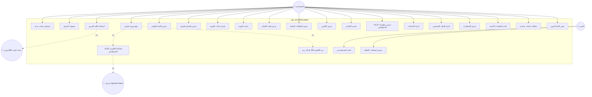

---

## 3.3 وصف حالات الاستخدام الرئيسية

### 3.3.1 حالة الاستخدام: رفع ومعالجة فاتورة

| العنصر | الوصف |
|--------|-------|
| **الاسم** | رفع ومعالجة فاتورة |
| **الفاعل الرئيسي** | المستخدم المسجل |
| **الفاعلون الثانويون** | محرك OpenAI Vision، قاعدة البيانات |
| **الشرط المسبق** | المستخدم مسجل الدخول بتوكن JWT صالح |
| **المسار الأساسي** | 1. يرفع المستخدم صورة الفاتورة<br>2. النظام يحفظ الصورة في مجلد uploads<br>3. النظام يرسل الصورة لمحرك OpenAI Vision<br>4. المحرك يستخرج البيانات المهيكلة<br>5. النظام يقرأ رمز QR إن وُجد<br>6. النظام يُطبّع العملة (Currency Normalization)<br>7. النظام يُطبّع أسماء المنتجات<br>8. النظام يسترجع البيانات المالية المفقودة<br>9. النظام يتحقق من صحة البيانات<br>10. النظام يحفظ الفاتورة في قاعدة البيانات<br>11. النظام يرسل إشعاراً للمستخدم |
| **الشرط اللاحق** | الفاتورة محفوظة مع جميع بياناتها في قاعدة البيانات |
| **المسار البديل** | إذا فشل التحليل بالذكاء الاصطناعي، يُسجّل الخطأ ويُعاد رسالة فشل |

### 3.3.2 حالة الاستخدام: تسجيل الدخول

| العنصر | الوصف |
|--------|-------|
| **الاسم** | تسجيل الدخول |
| **الفاعل الرئيسي** | المستخدم |
| **الشرط المسبق** | المستخدم لديه حساب مسجل |
| **المسار الأساسي** | 1. يُدخل المستخدم البريد الإلكتروني وكلمة المرور<br>2. النظام يتحقق من البيانات<br>3. النظام ينشئ جلسة مستخدم<br>4. النظام يُصدر توكن JWT<br>5. يتم توجيه المستخدم للوحة التحكم |
| **الشرط اللاحق** | المستخدم مسجل الدخول بتوكن صالح |
| **المسار البديل** | بيانات خاطئة → رسالة خطأ "بيانات غير صحيحة" |

---

## 3.4 مخطط الفئات (Class Diagram)

يوضح هذا المخطط الفئات الرئيسية في النظام والعلاقات بينها.

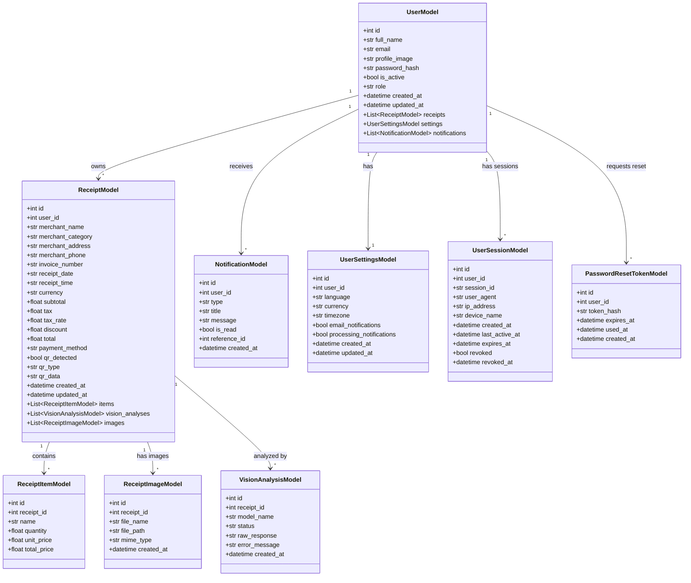

---

## 3.5 مخطط فئات طبقة Schemas (Pydantic)

يوضح هذا المخطط نماذج التحقق من البيانات المستخدمة في الـ API.

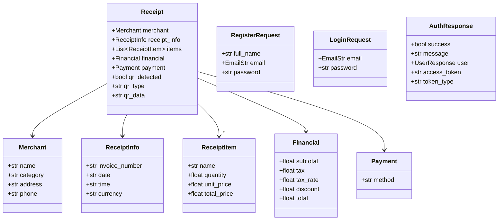

---

## 3.6 مخطط التسلسل (Sequence Diagram) — معالجة فاتورة

يوضح هذا المخطط التفاعلات بين المكونات عند رفع ومعالجة فاتورة.

```mermaid
sequenceDiagram
    actor User as المستخدم
    participant API as Receipt API Route
    participant Pipeline as ReceiptPipeline
    participant Vision as OpenAI Vision Engine
    participant QR as QR Code Reader
    participant CurrNorm as Currency Normalizer
    participant ProdNorm as Product Normalizer
    participant FinRec as Financial Recovery
    participant Validator as Receipt Validator
    participant Storage as Receipt Storage
    participant DB as MySQL Database

    User->>+API: POST /api/receipts/upload (image)
    API->>API: التحقق من JWT Token
    API->>API: حفظ الصورة في uploads/
    API->>+Pipeline: process(image_path, user_id)

    Pipeline->>+Vision: analyze(image_path)
    Vision->>Vision: تحويل الصورة إلى Base64
    Vision-->>-Pipeline: Receipt (بيانات مهيكلة)

    Pipeline->>+QR: read(image_path)
    QR-->>-Pipeline: QR Result (detected, type, data)

    Pipeline->>+CurrNorm: normalize(receipt)
    CurrNorm-->>-Pipeline: Receipt (عملة موحدة)

    Pipeline->>+ProdNorm: normalize(receipt)
    ProdNorm-->>-Pipeline: Receipt (أسماء منتجات نظيفة)

    Pipeline->>+FinRec: normalize(receipt)
    FinRec-->>-Pipeline: Receipt (بيانات مالية مسترجعة)

    Pipeline->>+Validator: validate(receipt)
    Validator-->>-Pipeline: ValidationResult

    Pipeline->>+Storage: save(db, receipt, image_path, user_id)
    Storage->>+DB: INSERT receipt
    DB-->>Storage: receipt_id
    Storage->>DB: INSERT receipt_items
    Storage->>DB: INSERT receipt_image
    Storage->>DB: INSERT vision_analysis
    Storage->>DB: INSERT notification
    Storage->>-DB: COMMIT
    Storage-->>-Pipeline: ReceiptModel

    Pipeline-->>-API: ProcessResult
    API-->>-User: JSON Response (success, receipt, validation)
```

---

## 3.7 مخطط التسلسل — تسجيل الدخول

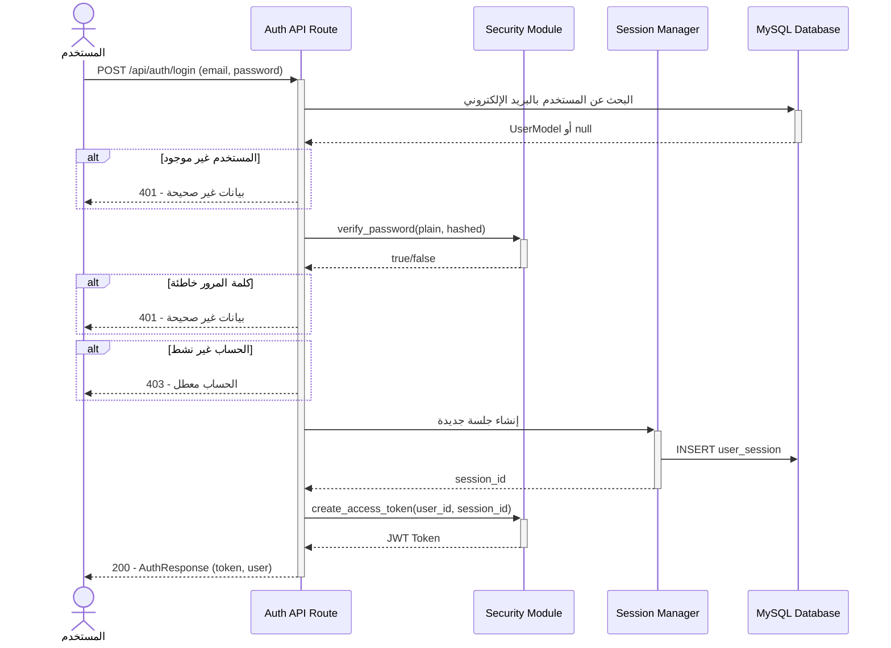

---

## 3.8 مخطط التسلسل — استعادة كلمة المرور

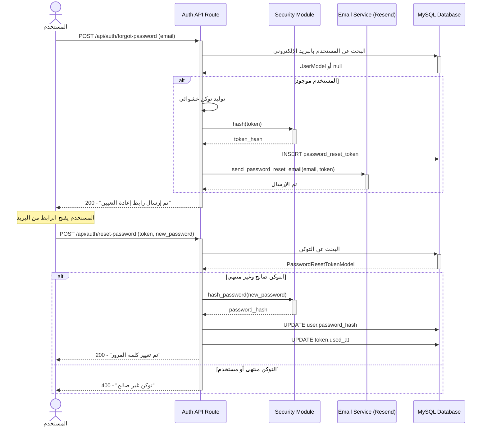

---

## 3.9 مخطط النشاط (Activity Diagram) — خط معالجة الفاتورة

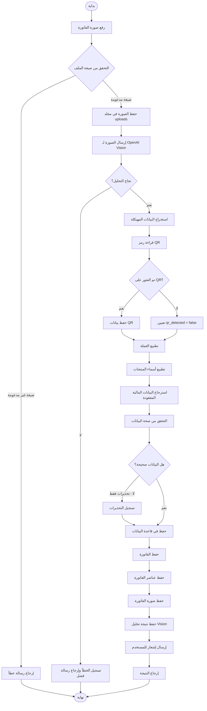

---

## 3.10 مخطط المكونات (Component Diagram)

يوضح هذا المخطط البنية المعمارية للنظام وطبقاته.

```mermaid
graph TB
    subgraph Frontend["طبقة العرض (Frontend)"]
        P1[index.html - الصفحة الرئيسية]
        P2[login.html - تسجيل الدخول]
        P3[register.html - التسجيل]
        P4[dashboard.html - لوحة التحكم]
        P5[receipts.html - الفواتير]
        P6[reports.html - التقارير]
        P7[analytics.html - التحليلات]
        P8[intelligence.html - الذكاء الاصطناعي]
        P9[settings.html - الإعدادات]
        P10[profile.html - الملف الشخصي]
        P11[notifications.html - الإشعارات]
        P12[security.html - الأمان]
        P13[admin.html - لوحة الإدارة]
    end

    subgraph APILayer["طبقة الـ API Routes"]
        R1[Auth Routes]
        R2[Receipt Routes]
        R3[Dashboard Routes]
        R4[Analytics Routes]
        R5[Reports Routes]
        R6[Intelligence Routes]
        R7[Settings Routes]
        R8[Notifications Routes]
        R9[Admin Routes]
    end

    subgraph ServiceLayer["طبقة الخدمات (Services)"]
        S1[ReceiptPipeline]
        S2[ReceiptStorage]
        S3[ReceiptRepository]
        S4[DashboardService]
        S5[AnalyticsService]
        S6[ReportsService]
        S7[IntelligenceService]
        S8[NotificationService]
    end

    subgraph CoreLayer["طبقة النواة (Core)"]
        C1[OpenAI Vision Engine]
        C2[Security - JWT & Password]
        C3[Receipt Validator]
        C4[Currency Normalizer]
        C5[Product Normalizer]
        C6[Financial Recovery]
        C7[QR Code Reader]
        C8[Email Service - Resend]
        C9[PDF Processor]
        C10[Config & Settings]
    end

    subgraph DataLayer["طبقة البيانات (Data Layer)"]
        DB[(MySQL Database)]
        FS[File System - uploads/]
    end

    subgraph External["خدمات خارجية"]
        OAI[OpenAI API]
        ResendAPI[Resend Email API]
    end

    Frontend --> APILayer
    APILayer --> ServiceLayer
    ServiceLayer --> CoreLayer
    ServiceLayer --> DataLayer
    CoreLayer --> External
    CoreLayer --> DataLayer
```

---

## 3.11 مخطط النشر (Deployment Diagram)

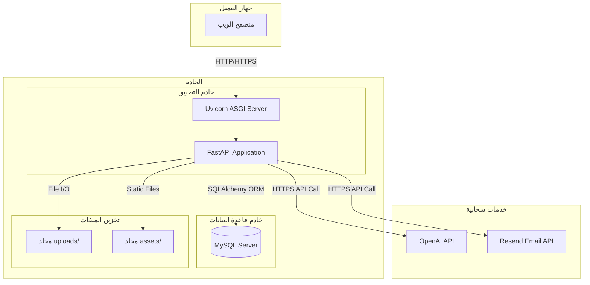

---

## 3.12 مخطط الكيان والعلاقات (ERD)

يوضح هذا المخطط جداول قاعدة البيانات والعلاقات بينها.

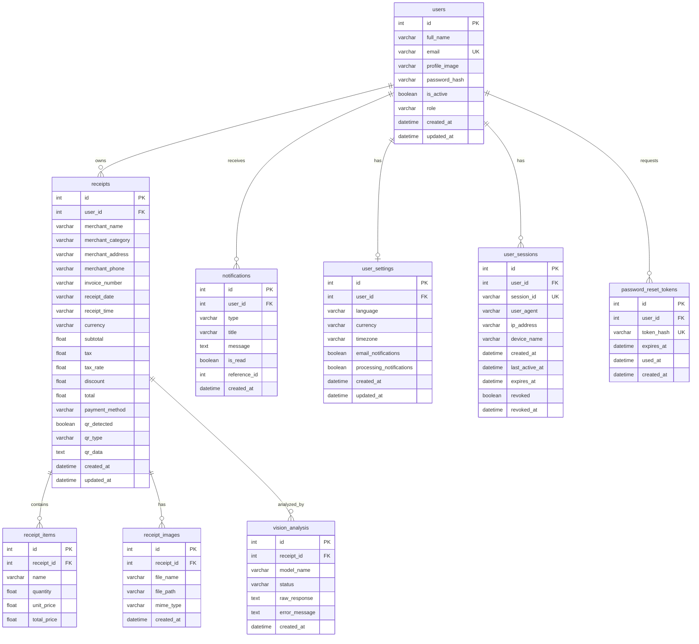

---

## 3.13 مخطط الحالة (State Diagram) — دورة حياة الفاتورة

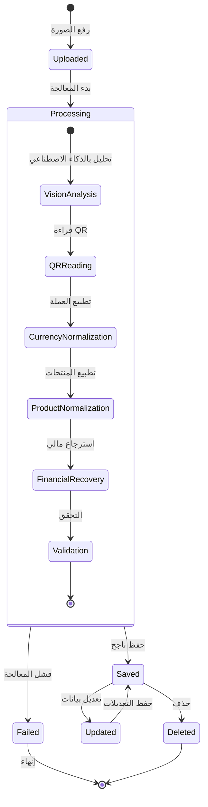

---

## 3.14 مخطط الحزم (Package Diagram)

```mermaid
graph TB
    subgraph app["📦 app"]
        subgraph api["📦 api"]
            subgraph routes["📦 routes"]
                auth_r[auth.py]
                receipt_r[receipt.py]
                dashboard_r[dashboard.py]
                analytics_r[analytics.py]
                reports_r[reports.py]
                intelligence_r[intelligence.py]
                settings_r[settings.py]
                notifications_r[notifications.py]
                admin_r[admin.py]
            end
        end

        subgraph models["📦 models"]
            user_m[user.py]
            receipt_m[receipt.py]
            receipt_item_m[receipt_item.py]
            receipt_image_m[receipt_image.py]
            vision_m[vision_analysis.py]
            notification_m[notification.py]
            settings_m[user_settings.py]
            session_m[user_session.py]
            token_m[password_reset_token.py]
        end

        subgraph schemas["📦 schemas"]
            auth_s[auth.py]
            receipt_s[receipt.py]
            dashboard_s[dashboard.py]
            analytics_s[analytics.py]
            intelligence_s[intelligence.py]
            reports_s[reports.py]
            settings_s[settings.py]
        end

        subgraph services["📦 services"]
            pipeline[receipt_pipeline.py]
            storage[receipt_storage.py]
            repository[receipt_repository.py]
            dashboard_svc[dashboard_service.py]
            analytics_svc[analytics_service.py]
            reports_svc[reports_service.py]
            intelligence_svc[intelligence_service.py]
            notification_svc[notification_service.py]
            qr_reader[qr_code_reader.py]
        end

        subgraph core["📦 core"]
            config[config.py]
            database[database.py]
            security[security.py]
            vision_engine[openai_vision_engine.py]
            validator[receipt_validator.py]
            currency_norm[currency_normalizer.py]
            product_norm[product_normalizer.py]
            financial_rec[financial_recovery.py]
            email[email.py]
            pdf[pdf_processor.py]
        end

        subgraph web["📦 web"]
            web_routes[routes.py]
        end

        main[main.py]
    end

    routes --> services
    routes --> schemas
    services --> models
    services --> core
    core --> database
    web --> models
    main --> routes
    main --> web
```

---

## 3.15 مخطط التسلسل — عرض لوحة التحكم

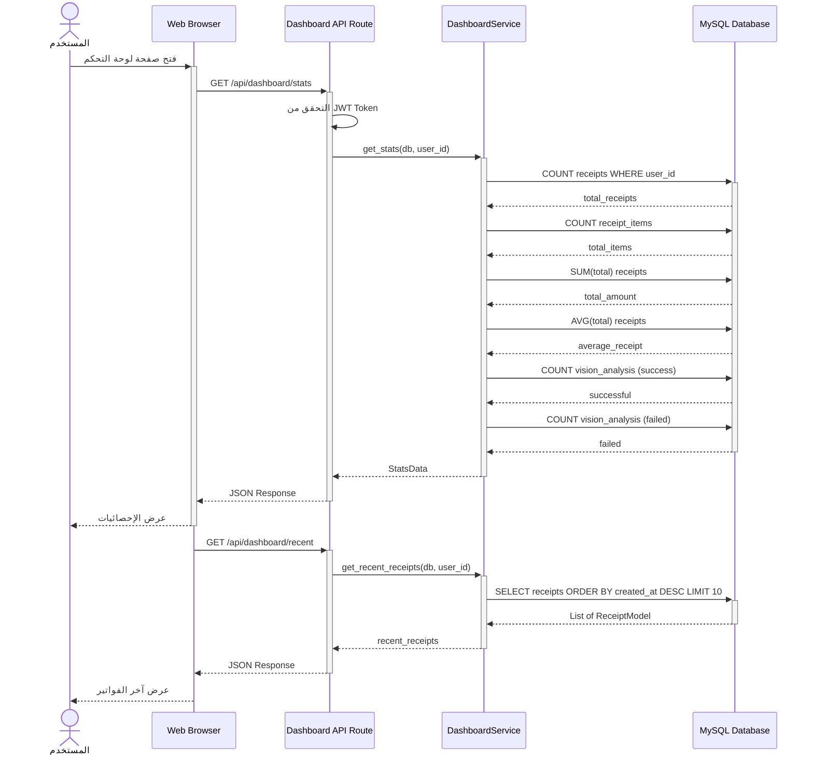

---

## 3.16 مخطط التسلسل — إنشاء التقارير

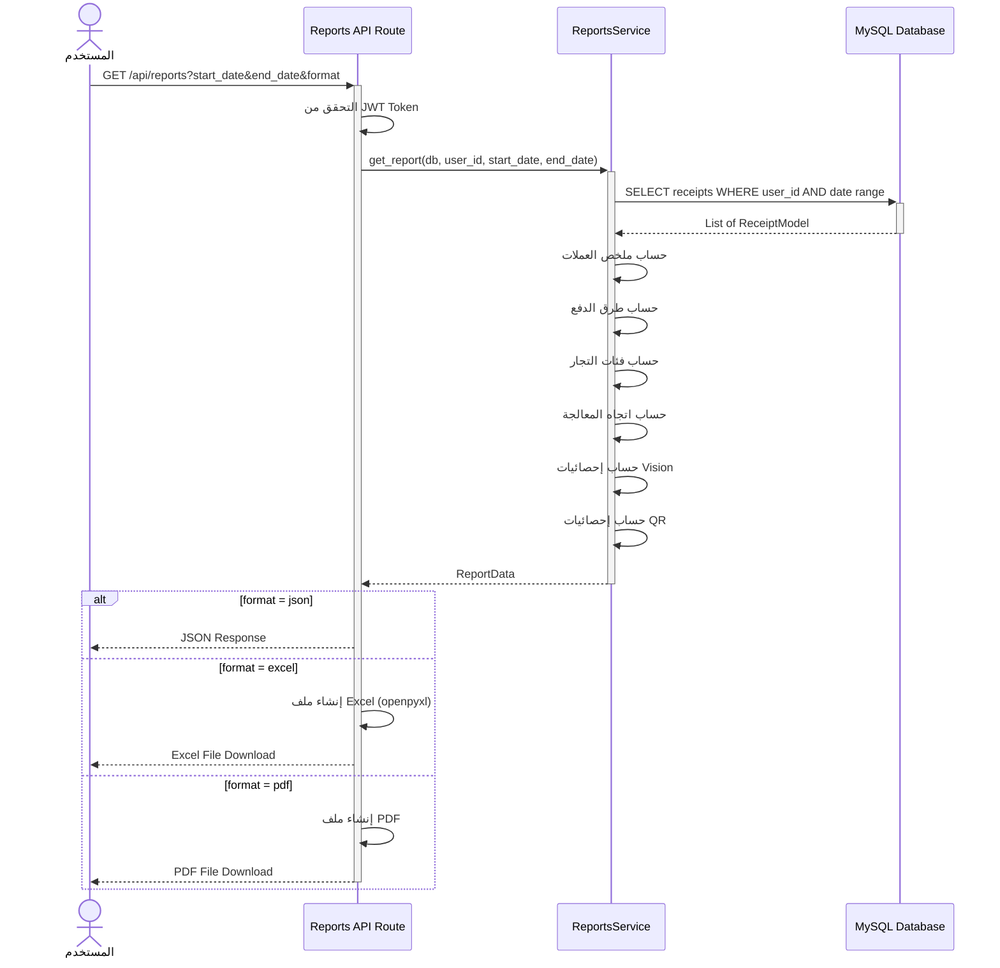

---

## 3.17 ملخص المخططات

| # | نوع المخطط | الغرض |
|---|-----------|-------|
| 1 | مخطط حالات الاستخدام (Use Case) | تحديد الفاعلين والوظائف الرئيسية للنظام |
| 2 | مخطط الفئات (Class Diagram) - Models | توضيح بنية البيانات والعلاقات في طبقة قاعدة البيانات |
| 3 | مخطط الفئات (Class Diagram) - Schemas | توضيح نماذج التحقق والاستجابة في الـ API |
| 4 | مخطط التسلسل - معالجة فاتورة | توضيح تدفق العمليات عند رفع ومعالجة فاتورة |
| 5 | مخطط التسلسل - تسجيل الدخول | توضيح عملية المصادقة وإصدار التوكن |
| 6 | مخطط التسلسل - استعادة كلمة المرور | توضيح عملية إعادة تعيين كلمة المرور |
| 7 | مخطط النشاط (Activity Diagram) | توضيح خطوات خط معالجة الفاتورة بالتفصيل |
| 8 | مخطط المكونات (Component Diagram) | توضيح البنية المعمارية وطبقات النظام |
| 9 | مخطط النشر (Deployment Diagram) | توضيح بيئة التشغيل والخدمات الخارجية |
| 10 | مخطط الكيان والعلاقات (ERD) | توضيح هيكل قاعدة البيانات والعلاقات بين الجداول |
| 11 | مخطط الحالة (State Diagram) | توضيح دورة حياة الفاتورة ومراحلها |
| 12 | مخطط الحزم (Package Diagram) | توضيح التنظيم الهيكلي لملفات المشروع |
| 13 | مخطط التسلسل - لوحة التحكم | توضيح تدفق البيانات عند عرض الإحصائيات |
| 14 | مخطط التسلسل - التقارير | توضيح عملية إنشاء وتصدير التقارير |

---

## 3.18 خاتمة الفصل

قدّم هذا الفصل تحليلاً وتصميماً شاملاً لنظام SmartReceiptAI باستخدام 14 مخططاً من مخططات UML تغطي جميع جوانب النظام:

- **الجانب الوظيفي**: من خلال مخططات حالات الاستخدام والتسلسل والنشاط
- **الجانب الهيكلي**: من خلال مخططات الفئات والكيانات والحزم والمكونات
- **الجانب السلوكي**: من خلال مخطط الحالة ومخططات التسلسل التفصيلية
- **الجانب التشغيلي**: من خلال مخطط النشر

يتميز النظام ببنية **متعددة الطبقات (Layered Architecture)** تفصل بين طبقة العرض (Frontend)، وطبقة واجهة البرمجة (API Routes)، وطبقة الخدمات (Services)، وطبقة النواة (Core)، وطبقة البيانات (Data Layer)، مما يسهّل الصيانة والتوسع.
